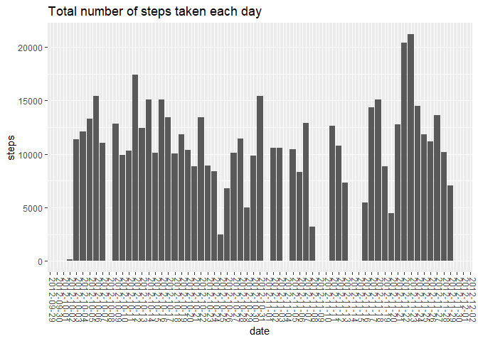
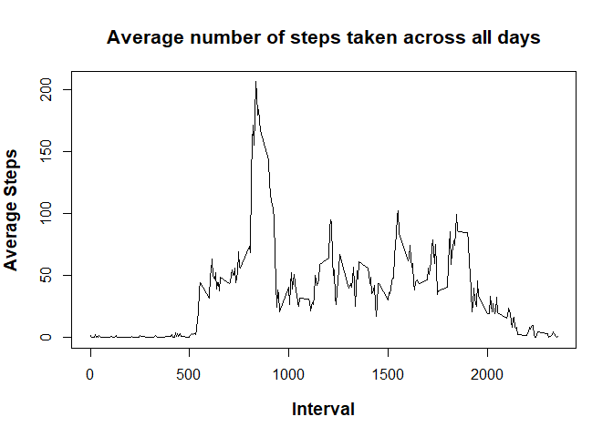
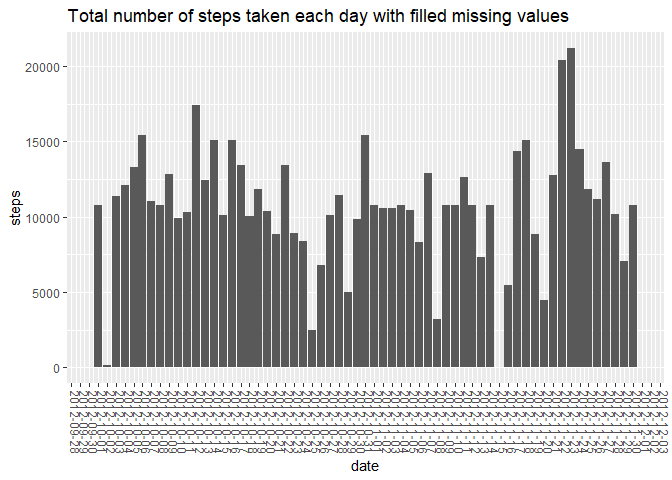
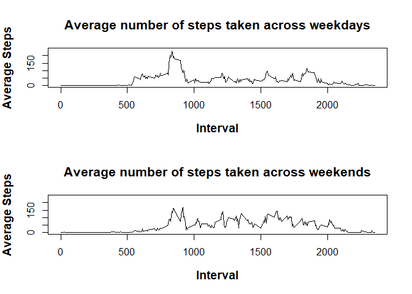

## Introduction

It is now possible to collect a large amount of data about personal movement using activity monitoring devices such as a Fitbit, Nike Fuelband, or Jawbone Up. These type of devices are part of the "quantified self" movement -- a group of enthusiasts who take measurements about themselves regularly to improve their health, to find patterns in their behavior, or because they are tech geeks. But these data remain under-utilized both because the raw data are hard to obtain and there is a lack of statistical methods and software for processing and interpreting the data.

This assignment makes use of data from a personal activity monitoring device. This device collects data at 5 minute intervals through out the day. The data consists of two months of data from an anonymous individual collected during the months of October and November, 2012 and include the number of steps taken in 5 minute intervals each day.

## Data

The data for this assignment can be downloaded from the course web site: Activity monitoring data <https://d396qusza40orc.cloudfront.net/repdata%2Fdata%2Factivity.zip> [52K]  

The variables included in this dataset are:

* **steps**: Number of steps taking in a 5-minute interval (missing values are coded as NA)
* **date**: The date on which the measurement was taken in YYYY-MM-DD format
* **interval**: Identifier for the 5-minute interval in which measurement was taken

The dataset is stored in a comma-separated-value (CSV) file and there are a total of 17,568 observations in this dataset.


## Loading and preprocessing the data


```r
suppressPackageStartupMessages( library(dplyr) )
library(dplyr)
library(ggplot2)
library(scales)
library(shiny)

#creates a folder to store the data if it doesn't exist
if (!file.exists("./data")){dir.create('./data')}

#Downloads data...and store it into a temporary file before unzipping it, it may take few seconds
if (!file.exists("data/activity.csv")){
  fileURL <- "https://d396qusza40orc.cloudfront.net/repdata%2Fdata%2Factivity.zip"
  temp <- tempfile()
  download.file(fileURL,temp)
  unzip(temp,exdir = "./data")
  unlink(temp)
}


#assigning the dataset to a data frame in R
data <- read.csv("data/activity.csv")
```

## What is mean total number of steps taken per day?

For this first part of the assignment we ignore missing values and remove them from the data set. But first we just want to make sure that we don't have **missing values** and valid **number of steps** mixed up in the same day. In other words if the sum of is.na() evaluations per day is equal to either 288 or 0. It would mean that we have either days with only missing values or days with real values.

```r
#making sure we don't have missing values and values mixed up in the same day
test_na <- data %>% group_by(date) %>% mutate(sum_by_group = is.na(steps))
test_tot <- aggregate(test_na["sum_by_group"], by=data["date"], sum)

numericInput("n","How many days do you want to see?", 5)
```

```{=html}
<div class="form-group shiny-input-container">
<label class="control-label" id="n-label" for="n">How many days do you want to see?</label>
<input id="n" type="number" class="form-control" value="5"/>
</div>
```

```r
renderTable({
 head(test_tot, input$n)
})
```

`<div id="outb36986474fffb5bf" class="shiny-html-output"></div>`{=html}


It seems that either we are missing data for the whole day or we have data. We can now safely remove missing values:


```r
#removing missing values
data_clean <- data[complete.cases(data$steps),]
```


Let us make a histogram of the total number of steps taken each day and save it:


```r
#we use the aggregate function to sum the steps for each day
data_total_day <- aggregate(data_clean["steps"], by=data_clean["date"], sum)

#converting the dates to the R date format
data_total_day$date <- as.Date(data_total_day$date)


p <- ggplot(data = data_total_day,
       aes(date, steps)) +
  stat_summary( # adds up all observations for the month
               geom = "bar") + # or "line"
  scale_x_date(
    labels = date_format("%Y-%m-%d"),
    breaks = "1 day") # custom x-axis labels
p <- p  + ggtitle("Total number of steps taken each day")
p2 <- p+theme(axis.text.x=element_text(angle=-90,vjust = 0))
print(p2)
```

```
## No summary function supplied, defaulting to `mean_se()`
```

<!-- -->

We can report the mean and median of the total number of steps taken per day


```r
#mean of the total number of steps taken per day
data_mean_day <- aggregate(data_total_day["steps"], by=data_total_day["date"], mean)
data_mean_day$date <- as.character(data_mean_day$date)
colnames(data_mean_day)[colnames(data_mean_day) == "steps"] <- "mean_steps"


#median of the total number of steps taken per day
data_median_day <- aggregate(data_total_day["steps"], by=data_total_day["date"], median)
data_median_day$date <- as.character(data_median_day$date)
colnames(data_median_day)[colnames(data_median_day) == "steps"] <- "median_steps"
```

### Mean

```r
numericInput("n",
 "Mean for how many days?", 5)
```

```{=html}
<div class="form-group shiny-input-container">
<label class="control-label" id="n-label" for="n">Mean for how many days?</label>
<input id="n" type="number" class="form-control" value="5"/>
</div>
```

```r
renderTable({
 head(data_mean_day, input$n)
})
```

`<div id="outcab874834c403128" class="shiny-html-output"></div>`{=html}

The mean across all days and intervals **is 10766**

### Median

```r
numericInput("n",
 "Median for how many days?", 5)
```

```{=html}
<div class="form-group shiny-input-container">
<label class="control-label" id="n-label" for="n">Median for how many days?</label>
<input id="n" type="number" class="form-control" value="5"/>
</div>
```

```r
renderTable({
 head(data_median_day, input$n)
})
```

`<div id="out5df20d63c81c79d4" class="shiny-html-output"></div>`{=html}

The median across all days and intervals **is 10765** 

## What is the average daily activity pattern?

Let's make a time series plot (i.e. type = "l") of the 5-minute interval (x-axis) and the average number of steps taken, averaged across all days (y-axis):


```r
data_total_intervals <- aggregate(data_clean["steps"], by=data_clean["interval"], mean)

plot(x = data_total_intervals$interval, y = data_total_intervals$steps,type = "l",xlab="",ylab="")
title("Average number of steps taken across all days",cex.main = 1.3,cex.lab=1.2,   font.main= 2,font.lab = 2,xlab = "Interval", ylab = "Average Steps" )
```

<!-- -->


```r
max_interval <- data_total_intervals$interval[which(data_total_intervals$steps==max(data_total_intervals$steps))]

print(max_interval)
```

```
## [1] 835
```
  
The 5-minute interval, on average across all the days in the dataset, that contains the maximum number of steps **is 835**

## Imputing missing values


```r
sum_na <- sum(is.na(data$steps))
print(sum_na)
```

```
## [1] 2304
```
  
The total number of missing values in the dataset (i.e. the total number of rows with NAs) **is 2304**  

We now want to devise a strategy to fill in the missing data. What we propose in this report, is to use the **median** of each interval across all days and impute this data to the missing values. We chose the median and not the mean can be sensitive to extreme behaviors of some people for example working over night. Here is how we can proceed:


```r
#we create another data set containing all the original data
data_filled <- data 

# we calculate the median across all days for each intervals
data_total_intervals_median <- aggregate(data_clean["steps"], by=data_clean["interval"], median)

# loop over the entire data set to replace each NA by the corresponding interval
count <- 1
for (i in 1:dim(data)[1]){
  if(data$interval[i] == 0){
    count <- 1
  }
  if(is.na(data$steps[i])){
    data_filled$steps[i] <- data_total_intervals$steps[count]
    count <- count +1
  }
}

#we can now sum the number of steps across all intervals 
data_total_filled <- aggregate(data_filled["steps"], by=data_filled["date"], sum)
data_total_filled$date <- as.Date(data_total_filled$date)
```
  
Let us plot and compare with the figure where we ignored missing values


```r
p_filled <- ggplot(data = data_total_filled,
            aes(date, steps)) +
  stat_summary( # adds up all observations for the month
    geom = "bar") + # or "line"
  scale_x_date(
    labels = date_format("%Y-%m-%d"),
    breaks = "1 day") # custom x-axis labels
p_filled <- p_filled  + ggtitle("Total number of steps taken each day with filled missing values")
p2_filled <- p_filled+theme(axis.text.x=element_text(angle=-90,vjust = 0))
print(p2_filled)
```

```
## No summary function supplied, defaulting to `mean_se()`
```

<!-- -->

As we can see, filling the missing values does not seem to impact bar plot, except that we now have additional data for the missing days.

Let's have a look at the mean and median:


```r
#mean of the total number of steps taken per day
data_mean_filled <- aggregate(data_total_filled["steps"], by=data_total_filled["date"], mean)
data_mean_filled$date <- as.character(data_mean_filled$date)
colnames(data_mean_filled)[colnames(data_mean_filled) == "steps"] <- "mean_steps"


#median of the total number of steps taken per day
data_median_filled <- aggregate(data_total_filled["steps"], by=data_total_filled["date"], median)
data_median_filled$date <- as.character(data_median_filled$date)
colnames(data_median_filled)[colnames(data_median_filled) == "steps"] <- "median_steps"
```

### Mean for missing values

```r
numericInput("n",
 "Mean for how many days?", 5)
```

```{=html}
<div class="form-group shiny-input-container">
<label class="control-label" id="n-label" for="n">Mean for how many days?</label>
<input id="n" type="number" class="form-control" value="5"/>
</div>
```

```r
renderTable({
 head(data_mean_filled, input$n)
})
```

`<div id="outba70152b5c895b06" class="shiny-html-output"></div>`{=html}

The mean across all days and intervals **is 10766**

### Median for missing values

```r
numericInput("n",
 "Median for how many days?", 5)
```

```{=html}
<div class="form-group shiny-input-container">
<label class="control-label" id="n-label" for="n">Median for how many days?</label>
<input id="n" type="number" class="form-control" value="5"/>
</div>
```

```r
renderTable({
 head(data_median_filled, input$n)
})
```

`<div id="outec230e9849dc4bb2" class="shiny-html-output"></div>`{=html}

The median across all days and intervals **is 10766**  

Imputing missing values does not seem to have a strong impact on the estimates of the total daily number of steps.

## Are there differences in activity patterns between weekdays and weekends?

For this part the data set containing the filled in missing values is going to be used.We want to compare the activity pertaing to the number of steps between weekdays and weekends.

First we reate a new factor variable in the dataset with two levels -- "weekday" and "weekend" indicating whether a given date is a weekday or weekend day:


```r
#creating a new data set
data_factor <- data_filled
data_factor$date <- as.Date(data_filled$date)

#vectors containing the name of the days for the weekend and week days as the weekdays() function returns the name of the days
wkend <- c("Saturday","Sunday")
wkdays <- c("Monday","Tuesday","Wednesday","Thursday","Friday")

#let's add a factor variable in the data set
data_factor$days <- factor((weekdays(data_factor$date) %in% wkdays), levels=c(FALSE, TRUE), labels=c('weekend', 'weekday')) 
data_factor_intervals_wkdays <- data_factor[data_factor$days %in% "weekday",]
data_factor_intervals_wkend <- data_factor[data_factor$days %in% "weekend",]
```

We can now make a panel plot containing a time series plot (i.e. type = "l") of the 5-minute interval (x-axis) and the average number of steps taken, averaged across all weekday days or weekend days (y-axis). 


```r
data_factor_intervals_wkdays <- aggregate(data_factor_intervals_wkdays["steps"], by=data_factor_intervals_wkdays["interval"], mean)
data_factor_intervals_wkend <- aggregate(data_factor_intervals_wkend["steps"], by=data_factor_intervals_wkend["interval"], mean)


par(mfrow=c(2,1))

plot(x = data_factor_intervals_wkdays$interval, y = data_factor_intervals_wkdays$steps,type = "l",xlab="",ylab="",ylim=c(0,240))
title("Average number of steps taken across weekdays",cex.main = 1.3,cex.lab=1.2,   font.main= 2,font.lab = 2,xlab = "Interval", ylab = "Average Steps" )
plot(x = data_factor_intervals_wkend$interval, y = data_factor_intervals_wkend$steps,type = "l",xlab="",ylab="",ylim=c(0,240))
title("Average number of steps taken across weekends",cex.main = 1.3,cex.lab=1.2,   font.main= 2,font.lab = 2,xlab = "Interval", ylab = "Average Steps" )
```

<!-- -->

It seems that in both cases we have more activity in the morning and it is even more emphasized for week days as people probably commute to work. However less activity is observed during the rest of the day during weekdays, maybe because the data was collecting on a population that is working in office. To the contrary on weekends we more activity across the day on average.  

